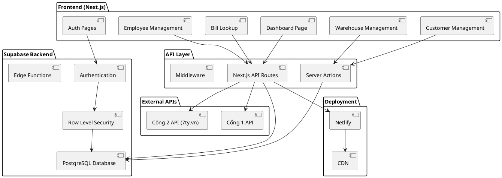
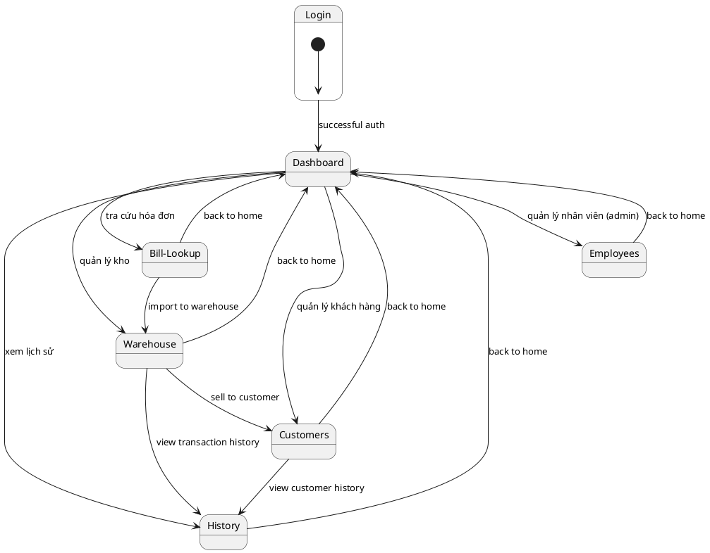
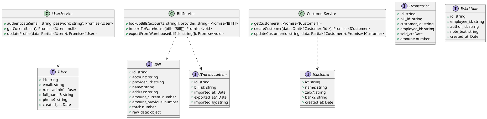
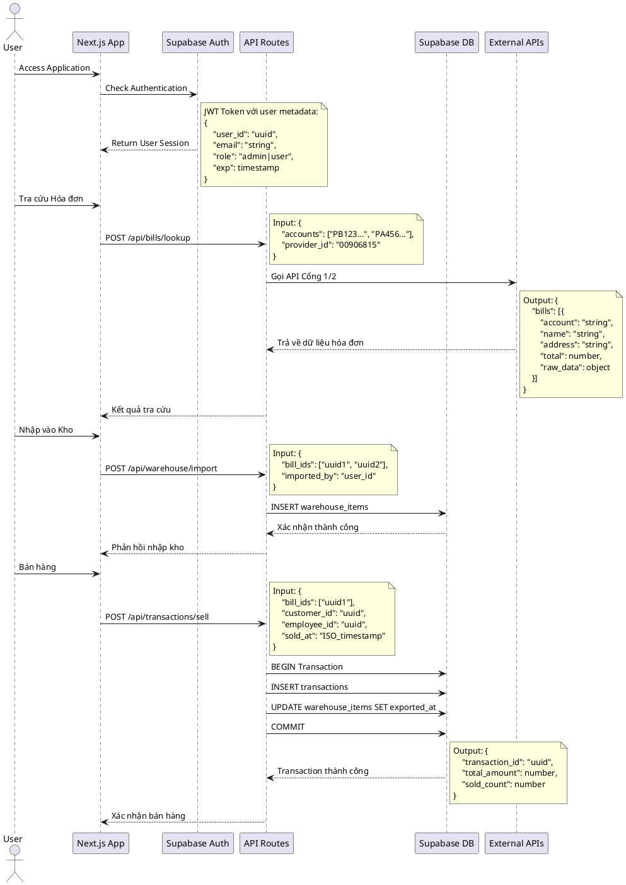
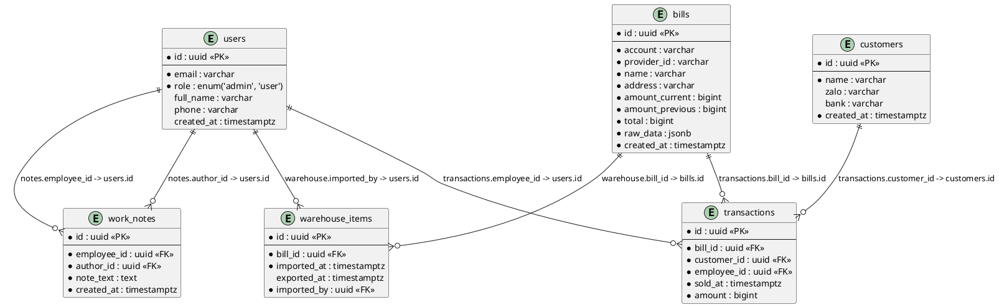

# Hệ thống Tra cứu Hóa đơn Điện - Thiết kế Hiện đại hóa

## 1. Phương pháp Triển khai

### Công nghệ Hiện tại vs Mục tiêu
**Hiện tại:**
- Backend: Express.js + PostgreSQL + bcrypt + session
- Frontend: Vanilla JS + Bootstrap 5 + HTML/CSS
- Deployment: Render (monolithic)

**Mục tiêu:**
- Full-stack: Next.js 14 + TypeScript + App Router
- Database: Supabase (PostgreSQL + Auth + RLS)
- UI: Shadcn-ui + Tailwind CSS + Radix UI
- Deployment: Netlify (serverless)
- Authentication: Supabase Auth với JWT

### Lý do Chuyển đổi
1. **Bảo mật nâng cao**: Supabase RLS, JWT tokens, serverless functions
2. **Hiệu suất tốt hơn**: Next.js SSR/SSG, edge functions, caching
3. **Developer Experience**: TypeScript type safety, modern tooling
4. **Scalability**: Serverless architecture, auto-scaling
5. **Maintainability**: Component-based architecture, better code organization

## 2. Tương tác Người dùng & UI chính

### Luồng Xác thực
1. **Đăng nhập** → Supabase Auth với email/password
2. **Phân quyền** → RLS policies dựa trên user role (admin/user)
3. **Session** → JWT tokens với auto-refresh

### Các Tương tác UI Chính
1. **Dashboard**: Tổng quan số liệu, quick actions
2. **Tra cứu Hóa đơn**: 
   - Input mã khách hàng (bulk/single)
   - Chọn nhà cung cấp (Cổng 1/Cổng 2)
   - Hiển thị kết quả dạng table/grid
3. **Quản lý Kho**:
   - Nhập hóa đơn vào kho
   - Lọc theo giá trị
   - Xuất/bán hóa đơn
4. **Quản lý Nhân viên** (Admin):
   - CRUD nhân viên
   - Phân quyền
   - Ghi chú công việc
5. **Quản lý Khách hàng thẻ**:
   - CRUD khách hàng
   - Lịch sử giao dịch

## 3. Kiến trúc Hệ thống

## 4. Luồng Điều hướng UI

## 5. Cấu trúc Dữ liệu & Interface

## 6. Luồng Xử lý Chương trình

## 7. Cấu trúc Database (Supabase)

## 8. Những điểm Chưa rõ

1. **Migration Strategy**: Cần xác định cách migrate dữ liệu từ PostgreSQL hiện tại sang Supabase
2. **API Rate Limiting**: Cần implement rate limiting cho external API calls
3. **Caching Strategy**: Quyết định sử dụng Redis hay Next.js built-in caching
4. **File Upload**: Nếu cần upload files (avatar, documents), sử dụng Supabase Storage
5. **Real-time Features**: Có cần real-time updates cho warehouse/transactions không?
6. **Mobile Responsiveness**: Mức độ tối ưu cho mobile devices
7. **Backup Strategy**: Cách backup và restore data từ Supabase
8. **Environment Variables**: Quản lý secrets và config cho multiple environments
9. **Error Monitoring**: Sentry hay monitoring service nào khác
10. **Testing Strategy**: Unit tests, integration tests, E2E tests scope

## 9. Kế hoạch Triển khai

### Phase 1: Setup & Infrastructure
- Setup Next.js 14 project với TypeScript
- Configure Supabase project và database schema
- Setup Shadcn-ui và Tailwind CSS
- Implement authentication với Supabase Auth

### Phase 2: Core Features
- Migrate bill lookup functionality
- Implement warehouse management
- Create user management system
- Build customer management

### Phase 3: Advanced Features  
- Add work notes system
- Implement transaction history
- Add reporting and analytics
- Performance optimization

### Phase 4: Deployment & Testing
- Deploy to Netlify
- Setup CI/CD pipeline
- Comprehensive testing
- Documentation và training